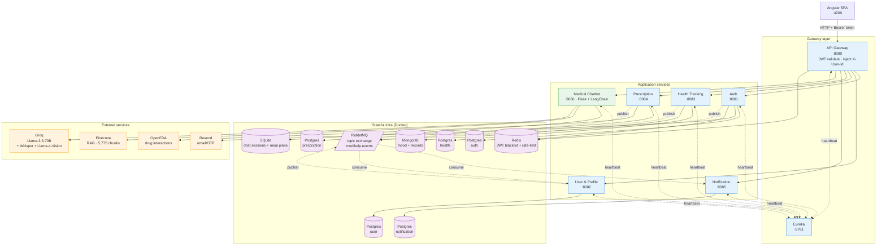
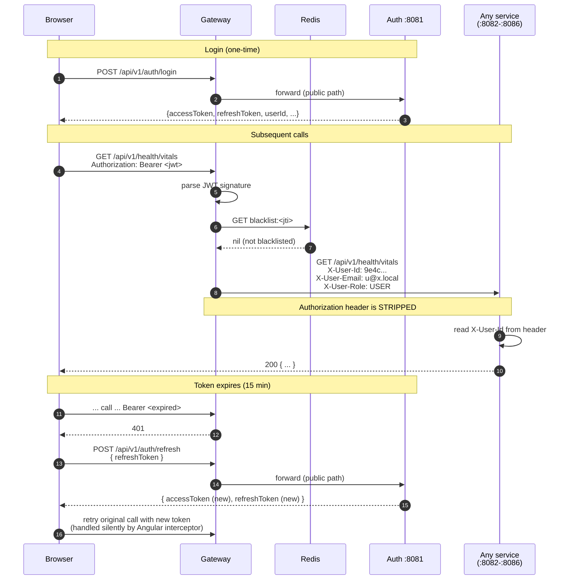
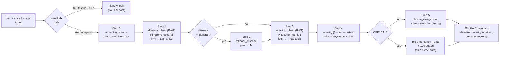
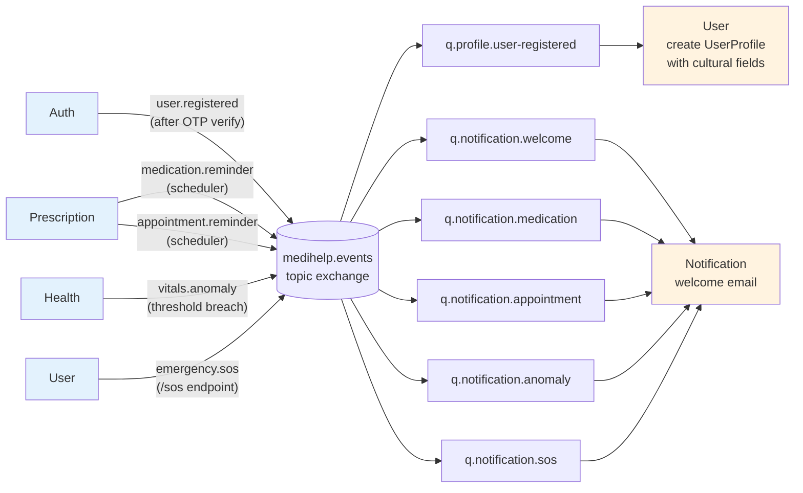

# MediHelp Architecture

Diagrams of the deployed system as of `main` (current `1c73bef`). Friend's
HuggingFace cultural-advisor is **not** wired in — `FRIEND_ADVISOR_URL` is
unset, the Groq path serves both structured meal plans and (future) narrative
cultural advice.

---

## 1. System overview

GitHub renders the Mermaid block natively (no images needed in the README/report).



**ASCII fallback** (for terminal viewing):

```
                      ┌──────────────────────────┐
                      │  Angular Browser :4200   │
                      └──────────┬───────────────┘
                                 │ HTTPS + JWT
                                 ▼
                      ┌──────────────────────────┐
                      │  API Gateway :8080       │
                      │  • validate JWT          │
                      │  • inject X-User-Id      │
                      │  • rate-limit (Redis)    │
                      └──────────┬───────────────┘
       ┌──────────┬──────────┬───┼──────────┬──────────┬────────┐
       ▼          ▼          ▼   ▼          ▼          ▼        ▼
   ┌──────┐  ┌──────┐  ┌──────┐ ┌─────┐  ┌──────┐  ┌──────┐ ┌──────┐
   │ Auth │  │ User │  │Health│ │Pres.│  │Notif.│  │Chatbot│ │Eureka│
   │ 8081 │  │ 8082 │  │ 8083 │ │8084 │  │ 8085 │  │ 8086 │ │ 8761 │
   └──┬───┘  └──┬───┘  └──┬───┘ └──┬──┘  └──┬───┘  └──┬───┘ └──────┘
      │         │         │ │      │        │         │
      ▼         ▼         ▼ ▼      ▼        ▼         ▼
   ┌──────┬─────────┬──────┴─┬───────┬───────┬───────────────┐
   │Pg-A  │Pg-User  │Pg-H/Mo │ Pg-P  │ Pg-N  │ SQLite + RAG  │
   └──────┴─────────┴────────┴───────┴───────┴───────────────┘

   Async ─── RabbitMQ topic exchange "medihelp.events" ───
   Auth → user.registered ─→ User · Notif
   Pres → medication.reminder, appointment.reminder ─→ Notif
   Health → vitals.anomaly ─→ Notif
   User  → emergency.sos ─→ Notif

   External
     Groq      ←─── Chatbot (chat/voice/vision)
     Pinecone  ←─── Chatbot (RAG retrieval)
     Resend    ←─── Auth (OTP), Notif (welcome/alerts)
     OpenFDA   ←─── Pres (drug interactions)
```

---

## 2. Authentication & JWT-header injection

The single non-obvious thing: **services never see the JWT**. The gateway
validates it and injects three trusted headers downstream.



**Key invariants:**
- Only `auth-service` knows the JWT secret and parses tokens
- All other services trust `X-User-Id` from the gateway (and only the gateway can write it because the gateway runs *inside* the trusted network)
- Logout = blacklist the JWT's `jti` in Redis. Subsequent calls with same token are rejected even though the signature is still valid

---

## 3. Chatbot RAG pipeline

5 steps per turn, ~5–8 LLM calls. Skips when input is small-talk.



**Cultural food advice (separate endpoint, called on user click):**

```
POST /api/food-suggestions
  ↓ read nutrition_targets[user, session]
  ↓ check meal_plans cache → return if hit
  ↓ Groq Llama-3.3 with prompt enriched by:
     - disease + restrictions
     - region (Tamil Nadu / Bengal / Punjab / ...)
     - diet_preference (Veg / Non-veg / Vegan / Eggetarian)
     - age + gender
  ↓ parse JSON, persist in meal_plans
  ↓ return structured plan
```

---

## 4. Async event flow (RabbitMQ)

Topic exchange `medihelp.events`. Six event types defined in `medihelp-common`.



**Event payloads** all carry `userId` so downstream consumers can fetch
caller context if needed. `UserRegisteredEvent` was extended in commit
`0ef2f3e` to include `firstName, lastName, dateOfBirth, gender, state,
dietPreference` so the user-service listener can populate `UserProfile` in
one transaction (no follow-up REST call).

---

## 5. Data residency

Where each user-owned data type lives — useful for the report's data privacy
section.

| Data type | Where | Encryption | Cross-service? |
|---|---|---|---|
| Email + password hash | Postgres-auth | bcrypt | No |
| User profile (name, DOB, gender, state, diet, allergies, conditions) | Postgres-user | TLS in transit | Read-only via `/users/me` |
| Family group + members | Postgres-user | TLS | No |
| Vitals time series | Postgres-health | TLS | Exported to FHIR |
| Mood journal entries | **MongoDB**, AES-256 on `journalText` field | AES-256 | Numeric scale only in FHIR; text never exported |
| Health records (uploaded files) | MongoDB, base64 in document | TLS | FHIR DocumentReference with inline Attachment |
| Prescriptions, medications | Postgres-prescription | TLS | No |
| Drug interaction cache | Postgres-prescription | — | (cached OpenFDA responses) |
| Notifications + preferences | Postgres-notification | TLS | No |
| Chat sessions, messages, meal plans | **SQLite** (chatbot service) | TLS | No |
| RAG vector embeddings | Pinecone cloud | Vendor TLS | No PII |
| JWT blacklist (logout) | Redis | TLS | No |

---

## 6. Service-to-service calls — there are none

Architectural rule: **no Feign clients between services**. All cross-service
data flow goes through one of:

1. **Gateway round-trip** — service A treats service B as an external API,
   calls `/api/v1/...` through the gateway like any client (rare, since
   most cross-service needs are eventual)
2. **RabbitMQ event** — service A publishes, service B subscribes (typical)

This keeps each service's failure domain self-contained: a Postgres outage
on prescription-service doesn't cascade into health-service.

---

## 7. Observability

Self-hosted Prometheus + Grafana (added in `742e95b`):

```
Prometheus :9090  ──── scrapes /actuator/prometheus on :8080-:8085  every 15s
       │
       ▼  (datasource)
Grafana :3000  ───── auto-loads "MediHelp Overview" dashboard
                     (heap by service, p95 latency, request rate, GC pause,
                      thread count, services-up stat)
```

Eureka (:8761) and the Python chatbot (:8086) aren't scraped — Eureka has
its own UI; the chatbot would need `prometheus_flask_exporter` (Phase 2).
