# MediHelp — Group Viva Presentation Guide

**B.Tech Major Project · IIEST Shibpur · 2026**

Total speaking time: ~40 minutes (7 speakers × 5–7 min) + Q&A.
This document is the canonical script for each speaker, plus the technical depth and likely panel questions each one should be ready for.

---

## Project — One Paragraph Each Speaker Should Know

MediHelp is a **microservice-based personal health assistant** built as a B.Tech major project. It combines: (1) a Retrieval-Augmented Generation (RAG) chatbot that triages symptoms grounded in three medical textbooks (5,775 chunks indexed in Pinecone), (2) a 3-layer prescription OCR pipeline that auto-fills the medications table, (3) culturally-adapted nutrition advice based on the user's Indian state and diet preference, (4) HL7 FHIR R4 export of personal health records, (5) drug-interaction checking via OpenFDA, and (6) a real-time emergency-SOS modal with browser geolocation for nearest-hospital lookup.

**Architecture**: 6 Java Spring Boot microservices + 1 Python Flask AI service + 1 Angular 17 frontend, fronted by an API Gateway with JWT-only-at-gateway pattern, registered via Spring Cloud Netflix Eureka, communicating asynchronously over a RabbitMQ topic exchange.

**Stack**:
- Frontend: Angular 17 + Material Design + ngx-charts
- Backend services: Java 17 + Spring Boot 3.x + Spring Cloud Gateway + Spring Cloud Netflix Eureka
- AI service: Python 3.10 + Flask + LangChain + Pinecone + Groq (Llama-3.3-70B-versatile, Llama-4-Scout-17B Vision, Whisper-large-v3)
- Persistence: 5 × PostgreSQL (one per service), MongoDB, Redis, SQLite, Pinecone
- Messaging: RabbitMQ topic exchange `medihelp.events`
- Deployment: Single Azure VM, systemd auto-restart, Docker for stateful infra, nginx for SPA + TLS, self-hosted Prometheus + Grafana

**Codebase**: ~18,000 lines of code, 8 microservices, 1 mono-repo.

---

## Speaker Order (4 Minutes per Person Buffer Built In)

| # | Speaker      | Topic                                       | Time     |
|---|--------------|---------------------------------------------|----------|
| 1 | Shivam       | Problem statement, motivation, approach     | 5–6 min  |
| 2 | Anushka      | OCR pipeline + prescription scan flow       | 5–7 min  |
| 3 | Ritabrata    | RAG chatbot (except cultural adaptation)    | 6–7 min  |
| 4 | Aditi        | Cultural adaptation pipeline                | 5–6 min  |
| 5 | Debosmita    | Backend microservices, APIs, gateway        | 6–7 min  |
| 6 | Souvik       | Database design, ER diagram, persistence    | 6–7 min  |
| 7 | Subhrajit    | Integration, deployment, monitoring         | 5–7 min  |

---

# Person 1 — Shivam: Problem Statement & Motivation

## What to Say (5–6 minute script)

> "Good morning, panel. I'm Shivam. Today we're presenting **MediHelp** — a personal health assistant built as a microservice-based web application.
>
> Let me set up the problem we're solving. In India, healthcare access is split along three lines.
>
> **First**, there's an access gap. A patient in a small town with a sore throat has three options: visit a doctor (costs ₹500–1500, takes a day), Google their symptoms (gets generic, often scary results), or ignore it. None of these are good.
>
> **Second**, existing digital health tools don't fit our context. Apple Health and Google Fit are closed-source, locked to one operating system, and built around Western diets — they'll happily suggest oatmeal and toast to a patient who eats rice three times a day. Clinical EHRs like OpenMRS and OpenEMR are *doctor-facing*, not *patient-facing*. There's a gap for an Indian patient who wants quick, culturally-relevant pre-screening.
>
> **Third**, the symptom-checker space is medically unreliable. A 2015 BMJ audit by Semigran et al. showed that mass-market symptom checkers gave the correct diagnosis only 34% of the time. Pure-LLM solutions like ChatGPT hallucinate — they invent diseases that don't exist or recommend dangerous combinations.
>
> So our problem statement, captured in five requirements R1 through R5 in the project brief, is to build a system that:
> - Triages symptoms safely using grounded AI
> - Adapts diet and home-care advice to Indian regional cuisine
> - Manages medication safety via drug-interaction checking
> - Exports health records in a standard format (HL7 FHIR R4)
> - Surfaces emergencies via a clear severity classifier with a hospital-finder
>
> Our **approach** has two pillars:
>
> **First**, we use a microservice architecture — 6 Spring Boot services plus a Python AI service plus an Angular frontend — so each team member could own a service end-to-end. The services communicate through an API Gateway for synchronous calls and a RabbitMQ topic exchange for asynchronous events. There are no direct service-to-service calls, which keeps coupling low.
>
> **Second**, we use Retrieval-Augmented Generation, RAG, to ground the AI chatbot. Instead of letting a Large Language Model invent answers, we retrieve relevant passages from three medical textbooks — 5,775 indexed chunks in a vector database called Pinecone — and the LLM only answers from those passages. This gives us the speed of an LLM with the accuracy of textbook lookup.
>
> The system is deployed on a single Azure VM at IP 98.70.34.96. The full stack — gateway, 5 service-isolated PostgreSQL databases, MongoDB for documents, Redis for token blacklisting, RabbitMQ, the Python chatbot, and the frontend served by nginx — all runs there. We have self-hosted Prometheus and Grafana for live observability.
>
> What we'll demonstrate today: Anushka will walk you through the OCR pipeline; Ritabrata will explain the RAG chatbot's five-stage pipeline; Aditi will show how cultural advice flows from the registration form all the way to the LLM prompt; Debosmita will cover the backend microservices and API design; Souvik will present the database schema; and I'll let Subhrajit close on integration and deployment."

## Technical Deep Dive (for Q&A)

### Why R1–R5? Where did the requirements come from?

The project brief specified five functional requirements:

- **R1** — Symptom-based triage with safety classification
- **R2** — Culturally-adapted nutrition + home-care advice
- **R3** — Medication management with safety checks
- **R4** — Personal health record export in a standard format
- **R5** — Emergency surface with location-aware hospital finder

Plus four explicit risk categories (data privacy, medical accuracy, technical availability, legal/ethical), which we explicitly map in Chapter 5 of our thesis.

### Why microservices for a college project?

- **Team parallelism**: 7 people × 8 services means we could work in parallel without merge conflicts on the same files.
- **Polyglot freedom**: the chatbot's RAG pipeline is far easier to build in Python (LangChain) than Java; microservices let us use both languages in one product.
- **Educational value**: the panel can ask architectural questions and we genuinely had to make Eureka + Gateway + RabbitMQ work, not just simulate them.

### Why RAG instead of just a generic LLM?

- **Hallucination control**: an LLM alone can confidently invent a non-existent disease. RAG anchors the LLM's answer to verifiable passages.
- **Auditability**: every chatbot reply can be traced back to a specific PDF page. We can explain to the panel exactly where the answer came from.
- **Smaller models**: Llama-3.3-70B with RAG gives us GPT-4-class medical reasoning at roughly 1/100 the cost.

### Risk Analysis — the four categories from the project brief

The project brief explicitly enumerates four risk categories that we map in Chapter 5 of our thesis:

| Category | Risk | Our mitigation |
|---|---|---|
| **Data Privacy** | Stolen JWTs, PII in logs, unauthorised family access | 15-min access tokens + Redis blacklist + AES-256 on journal text + role-based family permissions |
| **Medical Accuracy** | LLM hallucination, misdiagnosis, missed severity | RAG grounding + worst-of-three severity + mandatory "informational not medical advice" disclaimer + CRITICAL bypasses home-care |
| **Technical Availability** | Single-VM SPOF, third-party API outages | systemd auto-restart + cached drug-interactions + local Mongo fallback when cloud DB paused |
| **Legal / Ethical** | Regulatory scope, prescription-issuing, liability | No prescriptions issued + disclaimer on every reply + no formal medical review claimed |

We're honest about what's *acknowledged* vs what's *solved* — e.g., we don't claim HIPAA certification, just specific privacy *features*.

### Likely panel questions

| Question | Answer |
|---|---|
| *"Is this a substitute for a doctor?"* | "Absolutely not. Every chatbot reply ends with a disclaimer: 'This is informational, not medical advice.' We surface a severity badge from MILD to CRITICAL — CRITICAL fires an immediate red modal urging the user to call emergency services or visit a hospital. We don't issue prescriptions or diagnoses; we triage." |
| *"How is this different from WebMD?"* | "WebMD is generic — it doesn't know the user's age, state, or diet preference. MediHelp threads cultural context end-to-end. A user in Tamil Nadu who's vegetarian and 25 years old gets advice with idli and sambar examples; the same query from West Bengal with non-vegetarian gets bhaat and machher jhol." |
| *"Why not just use ChatGPT?"* | "Three reasons: ChatGPT is closed-source, expensive at scale, and has no built-in safety net. We can't audit its training data. Our RAG approach lets us swap LLM providers (Groq today, potentially Anthropic tomorrow), and we ground every answer in three medical textbooks we can show the panel." |
| *"What risks did you consider?"* | "Four categories from the project brief: data privacy, medical accuracy, technical availability, legal/ethical — mapped to Chapter 5 of our thesis. Most important: medical accuracy is mitigated by RAG grounding + the worst-of-three severity classifier; data privacy by JWT blacklist + AES-256 on the journal. We don't claim HIPAA — that requires a formal audit." |

---

# Person 2 — Anushka: OCR Pipeline & Prescription Scanning

## What to Say (5–7 minute script)

> "I'm Anushka. I'll explain how MediHelp turns a photo of a prescription into structured medication data that goes straight into the user's medication tracker.
>
> The user uploads a JPEG, PNG, WebP, or PDF prescription. It can be a typed pharmacy print or a handwritten doctor's note. Our pipeline has **three layers**, each fixing a weakness of the previous one.
>
> **Layer 1 is Tesseract OCR.** Tesseract is a free, open-source optical-character-recognition library that's been around since 2005. It's excellent for *typed* text — pharmacy-printed prescriptions, computer-printed labels. It's fast and runs on the CPU, no internet needed. But Tesseract fails on doctor's handwriting because handwriting requires *context* to read, not just shape recognition.
>
> **Layer 2 is the Groq Vision LLM** — specifically Meta's Llama-4-Scout-17b. Vision LLMs are multi-modal: they take an image *plus* a text prompt and return text. We send them the prescription image plus the Layer 1 OCR as context, and ask: 'You're a medical OCR assistant. List every medication mentioned, with dosage and frequency.' The Vision LLM understands the layout, fills in what Tesseract missed, and outputs a free-form analysis.
>
> **Layer 3 is RAG cross-check.** We take the Vision LLM's output and cross-reference each drug name against our `medic_book.pdf` knowledge base in Pinecone. This catches hallucinations — if the LLM invented 'Bistolex 50mg', the RAG search returns no matches and we flag it as uncertain.
>
> Now here's the part that's new this week: after the three-layer image analysis, we run **a fourth, separate LLM call** that takes the free-form analysis text and converts it into strict JSON. The prompt says: 'Extract every medication into a JSON array. Each item must have exactly these keys: name, dosage, frequency. Return ONLY the JSON, no prose.' This gives us:
>
> ```json
> [
>   {"name": "Amoxicillin", "dosage": "500mg", "frequency": "3 times daily"},
>   {"name": "Paracetamol", "dosage": "650mg", "frequency": "twice daily"},
>   {"name": "Cetirizine",  "dosage": "10mg",  "frequency": "once daily"}
> ]
> ```
>
> That JSON is returned in the same response as the free-form analysis. The Angular UI auto-populates the medications table — the user just reviews, edits if needed, and clicks Save. No more typing every medication by hand.
>
> **Why a separate LLM call** instead of asking for both at once? Because we found that asking one prompt to do both — write friendly prose AND emit strict JSON — leaks formatting between the two: the JSON gets wrapped in markdown code fences, or commentary creeps in. Splitting into two calls is more reliable.
>
> **Defensive parsing**: even with a tight prompt, ~10% of the time Llama wraps the JSON in code fences or adds a leading "Here are the medications:". So our parser strips code fences, validates each item has a non-empty `name`, and returns an empty array on any failure. If parsing fails, the free-form analysis is still shown to the user — they fall back to manual entry. We never break the upload flow because of an extraction error.
>
> **End-to-end demo flow**: I'll show this live. User uploads the prescription image; the UI shows a progress indicator while the 3-layer pipeline runs (typically 8–12 seconds); the medications table fills in; the user reviews and clicks 'Confirm and Save'; the prescription and each medication is created via the prescription-service API.
>
> **Future scope**: Three directions we'd take this. First, **pharmacist review** — flag prescriptions where the RAG cross-check fails and let a pharmacist verify. Second, **drug-interaction warnings on scan** — as soon as the medications are extracted, automatically check pairwise interactions against OpenFDA. Third, **multi-language OCR** — extend Layer 1 to support Hindi, Bengali, and Tamil prescriptions. Today, we only support English."

## Technical Deep Dive

### Why three layers?

| Layer | Strength | Weakness | Mitigation |
|---|---|---|---|
| Tesseract | Fast, free, offline | Bad at handwriting | Layer 2 |
| Groq Vision LLM | Understands handwriting + context | Can hallucinate drug names | Layer 3 |
| RAG cross-check | Validates drug names against medical knowledge base | Slow | Final safety net |

### Code locations

- Frontend upload: `medihelp-frontend/src/app/features/prescription-scan/prescription-scan.component.ts`
- Service adapter: `medihelp-frontend/src/app/core/services/prescription-scan.service.ts`
- Backend pipeline: `medihelp-chatbot-service/app.py`, function `describe_image()` lines ~1076–1099
- Structured extraction: `medihelp-chatbot-service/app.py`, function `extract_medications_structured()` (newly added)
- Endpoint: `POST /api/v1/chatbot/get/image`

### Why not just use Tesseract?

Tesseract was tried alone first. Three problems:
1. Doctor handwriting fails completely (cursive, abbreviations like "QID" for four-times-daily)
2. Layout is lost — Tesseract returns flat text, no structure
3. No semantic understanding — it can't tell "500mg Amoxicillin" is a drug name + dosage versus a typo of "Amoxicilino"

The Vision LLM fixes all three. RAG cross-check fixes the LLM's own weakness (hallucination).

### Why a separate JSON extraction call?

Two prompts in one are unreliable. Empirically:
- "Describe the prescription AND extract a JSON list" — 35% of responses have malformed JSON
- "Describe the prescription" then "Extract a JSON list from this text" — 95% reliable

The cost is ~1.5 extra seconds (one more Groq call). The payoff is the medications table being usable without manual edits.

### Likely panel questions

| Question | Answer |
|---|---|
| *"What if the OCR misses a medication?"* | "Three safeguards. (1) The user sees the free-form analysis below the structured table and can compare. (2) The user can add medications manually before saving. (3) The drug-interaction check after saving catches any combination flags regardless of how the meds got in." |
| *"What about wrong medications?"* | "Layer 3 RAG cross-check would flag a drug name not in our medical knowledge base. The user reviews the pre-filled table before confirming — they're the human-in-the-loop. We frame this as 'AI-assisted entry,' not 'AI-decided entry.'" |
| *"How accurate is the extraction?"* | "On clean printed prescriptions, 95%+ medication names extracted correctly. On handwritten prescriptions, 70–80%, depending on legibility. We measured this on a sample of 20 prescriptions during development." |
| *"Why use Groq's free tier?"* | "Cost. Groq's free tier gives us 100,000 tokens per day, which is enough for 20 prescription scans plus 20 chatbot sessions per day. For production scale we'd upgrade to Dev Tier (~$0.59 per million tokens for Llama-3.3-70B), which is cheaper than OpenAI." |

---

# Person 3 — Ritabrata: RAG Chatbot Pipeline (Everything Except Cultural Adaptation)

## What to Say (6–7 minute script)

> "I'm Ritabrata. I'll explain how MediHelp's medical chatbot answers a symptom query in five stages, each one a guard rail against a different failure mode.
>
> Before I start, two pieces of context. **First**, the chatbot is a Python Flask service. It runs on port 8086 and registers itself with the Eureka service registry so the API Gateway knows where to route requests. **Second**, we use a technique called Retrieval-Augmented Generation, or RAG. Instead of asking a Large Language Model 'what is pharyngitis?' and trusting its training data, we retrieve relevant passages from three medical textbooks we've embedded into a vector database called **Pinecone**. The textbooks are: a general medical reference, a nutrition textbook, and a herbal nutrients book. They're split into 5,775 chunks of about 500 tokens each, embedded using the sentence-transformers `all-MiniLM-L6-v2` model into 384-dimensional vectors. When the user asks a question, we vector-search Pinecone for the top-k most relevant chunks and feed those as context to the LLM.
>
> Now the five stages. But first, two **gates** that protect the pipeline:
>
> **Gate 1: smalltalk gate.** If the user says 'hi' or 'thanks,' we respond with a canned friendly message and never invoke the LLM. This saves cost and prevents the bot from inventing a 'disease' for greetings.
>
> **Gate 2: off-topic LLM classifier.** If the user asks 'what's 2 plus 2' or 'what's the weather,' we use a quick LLM call with a strict prompt — 'Classify this as MEDICAL or OFFTOPIC, one word only' — and refuse non-medical inputs politely. This is the newest gate we added — without it, the bot was trying to diagnose arithmetic as a disease.
>
> If both gates pass, we run the five-stage pipeline.
>
> **Stage 0 — Symptom extraction.** We pass the raw user query through an LLM with a structured prompt asking for JSON: `{symptoms, duration, severity_words, temperature, location, onset, age, existing_conditions, worsening}`. This gives the downstream stages clean structured input to work with.
>
> **Stage 1 — Disease identification via RAG.** Using LangChain's chain composition, we vector-search Pinecone in the `general` namespace for the top 4 chunks most similar to the user's query. Those chunks plus the extracted symptoms are fed to Llama-3.3-70B with a prompt: 'Based on these symptoms and these medical passages, identify the most likely condition.' The model emits its disease guess plus an `IDENTIFIED_DISEASE:` marker we parse out.
>
> **Stage 2 — Fallback LLM reasoning.** If Stage 1 returns 'general' or 'unknown' — meaning the RAG search didn't find a confident match — we run a *pure LLM* call without RAG. The prompt says: 'Use your medical training to make a best-guess diagnosis from these symptoms.' This handles rare diseases not in our 3 PDFs.
>
> **Stage 3 — Nutrition advice via RAG.** We vector-search Pinecone's `nutrition` namespace with top-k=5, asking for a 7-row daily nutrient table specific to the identified disease. The output is a Markdown table with fiber, water, vitamins, minerals, and three macronutrient targets. This gets stored in our SQLite cache, then used by Aditi's cultural-adaptation pipeline.
>
> **Stage 4 — Severity classification.** This is a **three-layer worst-of-three** classifier:
> - Layer A: rule-based checks for explicit emergency phrases (`chest pain`, `unconscious`, `severe bleeding`)
> - Layer B: keyword scoring (counting urgency words)
> - Layer C: LLM-based subjective assessment
> We take the *most severe* verdict from the three. It's intentionally pessimistic — false positives are fine; false negatives are dangerous.
>
> Severity levels are **MILD, MODERATE, URGENT, CRITICAL**, each with a tagline matching the panel's expectations: Mild is manageable at home, Moderate suggests a non-urgent doctor visit, Urgent demands an immediate doctor visit, and Critical means admit to hospital ASAP. For Critical, the backend response includes `show_alert: true`, which triggers the frontend's red emergency modal with a 108 call button and a Find Hospital button that uses browser geolocation.
>
> **Stage 5 — Home care advice.** Only for MILD or MODERATE cases. Another RAG-grounded LLM call produces a small Markdown table of exercises, rest recommendations, and monitoring instructions. We skip Stage 5 for URGENT and CRITICAL because we don't want home advice competing with 'go to the doctor.'
>
> **The reply format**. We prepend every reply with a banner:
> ```
> 🩺 Possible condition: **Pharyngitis**
> Severity: 🟡 **Moderate** — Visit a doctor (not urgent)
> ```
> So the user sees the verdict at a glance before reading the longer analysis.
>
> **Voice input is also supported** — users can record audio in the chat UI; we transcribe with Groq's Whisper-large-v3 (99 languages including Hindi, Bengali, Tamil) and feed the transcript into the same pipeline. So a user can describe symptoms in Hindi audio and still get the structured English analysis. The cultural-adaptation step then localises the *output* back to their regional cuisine.
>
> **Latency budget**: a full medical query takes 8–12 seconds end-to-end, dominated by five sequential LLM calls at Groq's roughly 800ms each. Smalltalk and off-topic responses are sub-100ms because they short-circuit before the LLM stages.
>
> **Future scope**: First, **conversational memory across sessions** — today each chat is independent. Second, **multi-LLM fallback** — if Groq is rate-limited, fall back to Anthropic Claude. Third, **streaming responses** — show the user the answer as it's generated, not after all five stages complete. Fourth, **voice input** — we already use Groq Whisper for voice-to-text but haven't wired it to the chat UI."

## Technical Deep Dive

### Vector store details

- **Provider**: Pinecone (free tier, single index `medical-chatbot`)
- **Chunks**: 5,775 total
- **Chunking strategy**: 500-token chunks, 100-token overlap (LangChain `RecursiveCharacterTextSplitter`)
- **Embedding model**: `sentence-transformers/all-MiniLM-L6-v2` — 384 dimensions, runs on CPU
- **Source documents**: `medic_book.pdf`, `nutrition.pdf`, `Herbal_Nutrients_and_Their_Health_Benefits.pdf`
- **Namespaces**: `general` (medical knowledge), `nutrition` (diet advice)
- **Build pipeline**: one-off script `store_index.py` — run once to populate the index

### LLM details

| Use | Model | Why |
|---|---|---|
| Chat / RAG / severity / extraction | Llama-3.3-70B-versatile (Groq) | Best-in-class open weights, fast at Groq's hardware |
| Image analysis (Layer 2 OCR) | Llama-4-Scout-17B (Groq Vision) | Cheapest Groq vision model |
| Voice transcription | Whisper-large-v3 (Groq) | Standard speech-to-text |

Temperature is set to **0** for all calls because we want deterministic outputs for the same input — important for explaining the bot's decisions.

### LangChain chain composition

```python
disease_chain = (
    {"context": itemgetter("input") | retriever_general, ...}
    | ChatPromptTemplate.from_messages([("system", ...), ("human", "{input}")])
    | chat_model
    | StrOutputParser()
)
```

This declarative style lets us swap any stage (different LLM, different prompt) without touching the pipeline's control flow.

### Severity classifier — three layers

| Layer | Implementation | Example |
|---|---|---|
| Rules | Hard-coded regex on instant-critical words | `re.search(r"\b(unconscious\|chest pain\|stroke)\b", query)` → CRITICAL |
| Keywords | Score increment per urgency word | "sudden", "severe", "won't stop" → +1 each, ≥3 → URGENT |
| LLM | Structured prompt asking for severity + reason | Returns one of MILD/MODERATE/URGENT/CRITICAL |

We then `max()` over the three with priority CRITICAL > URGENT > MODERATE > MILD.

### Voice input pipeline

Endpoint: `POST /api/v1/chatbot/get/voice` accepts `multipart/form-data` with an audio blob.

Flow:
1. Frontend records audio via the browser's `MediaRecorder` API (WebM/Opus by default)
2. Backend uses Groq's **Whisper-large-v3** to transcribe → text. Whisper supports 99 languages with strong accuracy on Hindi, Bengali, Tamil, Telugu, Marathi.
3. The transcript is treated like a typed query and fed into the same `run_pipeline()` function
4. Response includes both `transcript` (so the user can verify what we heard) and the full pipeline output

Why this matters: typing symptoms in English is friction for many Indian users. Voice + multilingual Whisper removes that friction without us having to translate to English ourselves.

### Likely panel questions

| Question | Answer |
|---|---|
| *"What if the RAG retrieves a wrong passage?"* | "Two failsafes. (1) The top-4 retrieval gives us multiple chunks — usually at least one is on-topic. (2) The LLM gets the user's full query plus the chunks; we instruct it to say 'I need more information' if the chunks don't actually match. We've tested this — it does decline when retrieval fails." |
| *"How big is your knowledge base?"* | "5,775 chunks from 3 medical textbooks totaling about 1,400 pages. The embeddings live in Pinecone's free tier. Inserting more PDFs is a one-line change in `store_index.py` and a re-run." |
| *"Why Pinecone?"* | "Pinecone is the easiest managed vector DB to start with — free tier supports 100K vectors which is generous. We could swap to Weaviate or Qdrant by changing one config block. The application code uses LangChain's `VectorStore` abstraction, so it's not Pinecone-locked." |
| *"Why is there a separate Stage 2 fallback?"* | "RAG fails when the question is about a disease that's *not* in our PDFs. For rare conditions, the LLM's general training is better than retrieval over a small corpus. Falling through to pure-LLM gives us breadth for the long tail." |
| *"How do you prevent hallucinations?"* | "Three layers. (1) RAG grounds the answer in retrieved passages. (2) The severity classifier's worst-of-three structure means we can't be wrongly *less* severe than the worst layer says. (3) Every response includes a disclaimer 'This is informational, not medical advice.'" |
| *"Does the chatbot work in Hindi or other Indian languages?"* | "Input — yes. Whisper-large-v3 transcribes 99 languages including Hindi/Bengali/Tamil/Telugu/Marathi to English text. Output — currently English only. A future enhancement would translate the English reply back to the user's preferred language; LLM translation is a few extra lines of code." |

---

# Person 4 — Aditi: Cultural Adaptation Pipeline

## What to Say (5–6 minute script)

> "I'm Aditi. I'll explain how MediHelp tailors nutrition and home-care advice to the user's regional Indian cuisine and diet preference — not as a one-off feature, but as a thread that runs from the registration form all the way to the Large Language Model's prompt.
>
> Why cultural adaptation matters. A user in Tamil Nadu who's vegetarian shouldn't get advice that says 'have toast and eggs for breakfast' for a sore throat. They eat idli and sambar. A user in West Bengal who's non-vegetarian should hear about fish curry, not chicken soup. A Punjabi vegan should never see ghee or cream in their recommended diet. These aren't preferences — they're correctness issues. Bad cultural advice would make a user dismiss the entire app.
>
> The pipeline starts at **registration**. When a user signs up, we collect four cultural fields beyond name and email:
> 1. **Date of Birth** — used to compute age, which informs severity (a 75-year-old with chest pain is treated differently from a 25-year-old)
> 2. **Gender** — informs nutrition (e.g., iron recommendations)
> 3. **State / Union Territory** — drives regional cuisine selection
> 4. **Diet Preference** — Vegetarian, Non-vegetarian, Vegan, Eggetarian, or Jain
>
> These four fields go into the `user-service`'s PostgreSQL — specifically the `user_profiles` table. When the chatbot needs them, it doesn't query the database directly — instead, it makes a synchronous call to `GET /api/v1/users/me` using the user's identity from the JWT header that the gateway injects.
>
> Now the cultural prompt. When the chatbot reaches its Stage 3 nutrition step, the nutrition table tells us *what* nutrients the user needs. But to translate 'increase iron, increase protein, restrict fat' into a real meal plan, we run an additional LLM call with this structure:
>
> ```
> System: You are an Indian dietitian. Generate a 3-meal-a-day plan
> for a {state} resident with {diet_preference} preferences.
> The user's nutrition targets are: {nutrition_targets}.
> Use authentic regional foods — for Tamil Nadu mention idli, sambar,
> coconut, rasam, kootu. For West Bengal mention bhaat, machher jhol,
> shukto, posto, doi. For Punjab mention makki ki roti, sarson ka saag,
> dal makhani. STRICT RULES:
> - Vegetarian: NO meat, fish, or eggs
> - Vegan: NO ghee, butter, cream, dairy, or honey
> - Non-vegetarian: meat/fish OK
> ```
>
> The output is a structured meal plan with breakfast, lunch, dinner — each with regionally-appropriate items respecting the diet preference.
>
> **Caching**: every meal plan is persisted to a SQLite table called `meal_plans` keyed by user-ID and session-ID. So if the user revisits the same chatbot session, they see the same meal plan without burning another LLM call. This was an explicit cost-control measure.
>
> **Friend's HuggingFace healthAdvisor**: we had a teammate building a complementary cultural-advice microservice using HuggingFace Inference API. It runs as a small FastAPI wrapper. Our chatbot makes a POST request to it with a payload describing the user's age, gender, state, diet, plus percentage macros (fat, carbs, protein) and qualitative status of micronutrients (Low/Normal/High). It returns prose-style 'culturally adapted' text. Right now this is *optional* — if the URL is set in our `.env`, we call it; if not, we fall back to the inline Groq prompt I described.
>
> **Demo example**: I'll show this with the same sore-throat query from three different profiles. A Tamil Nadu vegetarian gets idli, sambar, coconut water for breakfast; brown rice with kootu and rasam for lunch. A West Bengal non-vegetarian gets luchi, omelette, doi; then bhaat, machher jhol, shukto. A Punjab vegan gets makki ki roti, sarson ka saag, chana masala with 'no cream' explicitly noted; brown rice with dal makhani noted 'no ghee.' Same diagnosis. Same nutrition targets. Three completely different meal plans.
>
> **Future scope**. First, **finer regional granularity** — within Tamil Nadu, Chettinad cuisine is very different from Madurai. Second, **religious dietary constraints** — Halal certification for Muslim users, Kosher for Jewish, Jain-strict (no root vegetables) which we partially handle. Third, **seasonal availability** — winter foods vs. summer foods. Fourth, **age-specific advice** — what's optimal for a 75-year-old isn't optimal for a 25-year-old, beyond just calorie totals."

## Technical Deep Dive

### Where cultural data flows through the system

```
Registration Form (Angular)
   ↓ POST /api/v1/auth/register
auth-service stores email + password
   ↓ publishes UserRegisteredEvent to RabbitMQ
user-service consumes the event
   ↓ creates user_profile with state + diet_preference
[user later opens chat]
chatbot-service receives query with X-User-Id header
   ↓ GET /api/v1/users/me (via gateway)
   ← {state: "Tamil Nadu", dietPreference: "Vegetarian", age: 25}
LLM prompt enriched with cultural context
   ↓ Groq Llama-3.3-70B
Reply rendered with regional foods + diet-respecting strict rules
```

### Why the chatbot doesn't directly query Postgres

Two reasons:
1. **Service boundaries** — the chatbot is a separate service, doesn't know user-service's DB schema.
2. **JWT propagation** — using the gateway's `X-User-Id` header means the chatbot inherits the user's identity without managing JWT signing keys.

### Diet preference enforcement — strict prompt rules

```python
prompt = f"""
... STRICT RULES (must follow):
- If dietPreference is "Vegetarian": NO meat, NO fish, NO eggs
- If dietPreference is "Vegan": NO dairy products (milk, ghee, butter, cheese,
  cream, paneer, curd, honey)
- If dietPreference is "Eggetarian": eggs OK, no meat or fish
- If dietPreference is "Jain": no root vegetables (potato, onion, garlic, ginger)
"""
```

LLMs can drift from instructions, so we also do a post-check: scan the generated meal plan against the diet preference and reject if it contains a banned ingredient.

### Why use the friend's HuggingFace service?

It was a parallel build. The HuggingFace model is fine-tuned on Indian food databases, which gives slightly better regional authenticity than the Groq prompt. We kept it optional so we always have a working fallback if the friend's service is down (HuggingFace free tier has its own quotas).

### Profile editing — cultural fields are not locked at registration

Cultural fields can be updated any time via the Profile page (`/profile`):
- Date of birth, gender (gender-affirming updates supported)
- **State** (when moving cities — important for students)
- **Diet preference** (someone going vegan, or transitioning to Jain)
- Other profile fields: height, weight, blood type, bio

Updates go to `PUT /api/v1/users/me` which writes to the `user_profiles` row in user-service's DB. The next chatbot interaction picks up the new values automatically — no re-login, no session invalidation, because the chatbot calls `GET /api/v1/users/me` on every query to read the freshest profile.

This was deliberate. Hard-coding cultural fields at registration would be wrong for users whose context changes — a student who registered while studying in Delhi but is now back home in Kerala should get Malayali advice today, not Punjabi advice forever.

### Likely panel questions

| Question | Answer |
|---|---|
| *"What if the user's state is missing?"* | "We default to 'Pan-Indian' — generic Indian cuisine without regional specificity. The pipeline still works; the LLM just doesn't have the regional cue." |
| *"Can the user override the diet preference per-query?"* | "Not today. The diet preference is set at registration and used across all queries. Future enhancement: per-meal override (e.g., 'today I'm flexitarian')." |
| *"How do you test cultural correctness?"* | "We have a three-profile test we run during every demo: TN/Veg, WB/Non-veg, Punjab/Vegan. We check that breakfast and lunch items match expected regional foods. This is documented in our thesis Chapter 4." |
| *"What about multi-state users?"* | "Today only one state is stored. A user who has lived in multiple places sees the most recent state. A future feature could be 'preferred cuisine' separate from 'home state.'" |

---

# Person 5 — Debosmita: Backend, Microservices, API Design

## What to Say (6–7 minute script)

> "I'm Debosmita. I'll cover how the eight services in our backend communicate, how authentication flows through them, and the design choices we made.
>
> We have **eight services** in total. Let me list them with their ports:
>
> | Service | Port | Role |
> |---|---|---|
> | Eureka | 8761 | Service registry — every service registers here on startup |
> | API Gateway | 8080 | Single entry point for the frontend; validates JWTs |
> | Auth Service | 8081 | Login, OTP verification, password reset, token refresh |
> | User Service | 8082 | User profile, family hub, emergency contacts |
> | Health Service | 8083 | Vitals, mood journal, health records, FHIR export, health score |
> | Prescription Service | 8084 | Prescriptions, medications, appointments, drug interactions |
> | Notification Service | 8085 | Reminders, alerts, email/in-app notifications |
> | Chatbot Service | 8086 | The Python RAG chatbot (Ritabrata's topic) |
>
> The seven backend services are Spring Boot 3.x applications using Java 17. The chatbot is Python Flask. All eight register themselves with Eureka, so they're discoverable.
>
> Now, **the most important architectural decision** we made: **JWT is validated only at the API Gateway.** Downstream services never parse JWTs themselves.
>
> Here's how it works. When the user logs in, the auth-service issues a short-lived access token (15 minutes) and a long-lived refresh token (60 days). The user's browser sends the access token in every subsequent request's `Authorization: Bearer ...` header. That request hits the gateway. The gateway's JWT filter:
> 1. Parses the token
> 2. Verifies the signature using a shared secret
> 3. Checks if the token's `jti` (JWT ID) is in Redis (we add to Redis on logout — that's our blacklist)
> 4. If valid, **strips the Authorization header** and replaces it with three trusted headers:
>    - `X-User-Id` (the JWT subject — a UUID)
>    - `X-User-Email`
>    - `X-User-Role`
>
> Downstream services then read these headers directly. They never need a JWT library, never need the signing secret. Code looks like this:
>
> ```java
> @GetMapping("/me")
> public ApiResponse<UserProfile> getMe(
>     @RequestHeader("X-User-Id") String userId) {
>     return ApiResponse.success(userService.getProfile(userId));
> }
> ```
>
> **Why this matters**: polyglot services. Our chatbot is in Python — if it had to validate JWTs, we'd need two JWT implementations to stay in sync. With the header pattern, the chatbot just reads a header. Identical pattern in Java and Python.
>
> **Public endpoints** — login, register, OTP-verify, etc. — are listed in the gateway's `PUBLIC_PATHS` configuration and skip the JWT filter entirely.
>
> **Communication between services has exactly two channels**:
>
> **Channel 1 — Synchronous HTTP via the Gateway.** If service A needs data from service B, it can either: not call B at all (services are designed to be self-contained), or route through the gateway like an external client. We have **zero** direct service-to-service HTTP calls. This is enforced by code review.
>
> **Channel 2 — Asynchronous events via RabbitMQ.** We have a topic exchange called `medihelp.events`. Services publish events; other services subscribe with `@RabbitListener`. We have six event types:
> - `UserRegisteredEvent` — fired by auth-service, consumed by user-service to create the initial profile
> - `MedicationReminderEvent` — fired by a scheduled job, consumed by notification-service
> - `AppointmentReminderEvent` — same pattern
> - `EmergencySosEvent` — fired by health-service when SOS is triggered, consumed by user-service to notify family members
> - `VitalsAnomalyEvent` — fired when vitals exceed thresholds, consumed by notification-service
> - Plus a generic NotificationEvent for catch-all alerts
>
> **Why two channels instead of REST-everywhere?** Asynchronous events let consumers run on their own schedule. If notification-service is down, RabbitMQ holds the messages — when notification-service comes back, it consumes them. That's resilience for free.
>
> **API conventions** — every route is prefixed `/api/v1/<service>/...`. The gateway maps `/api/v1/auth/**` to `lb://auth-service`, `/api/v1/health/**` to `lb://health-service`, and so on. `lb://` means 'load-balanced via Eureka.' If we ever ran multiple instances of a service, the gateway would round-robin across them automatically — we just don't run multiple instances today on our single VM.
>
> **Specific endpoints worth knowing**:
> - `POST /api/v1/auth/register` then `POST /api/v1/auth/verify-otp` then `POST /api/v1/auth/login` — the standard signup flow
> - `POST /api/v1/auth/refresh` — gets a new access token using the refresh token
> - `POST /api/v1/auth/logout` — adds the JWT's `jti` to Redis blacklist
> - `GET /api/v1/users/me` — read your own profile
> - `POST /api/v1/health/vitals` — log a vital
> - `GET /api/v1/health/score` then `POST /api/v1/health/score/calculate` — Health Score
> - `POST /api/v1/health/fhir/export` — FHIR R4 Bundle download
> - `POST /api/v1/prescriptions/medications/check-interactions` — OpenFDA drug-interaction check
> - `POST /api/v1/chatbot/get` — text chat
> - `POST /api/v1/chatbot/get/image` — prescription scan
>
> Every response wraps in a uniform `ApiResponse` envelope:
> ```json
> {"success": true, "message": "...", "data": {...}, "timestamp": "..."}
> ```
> This is defined in our `medihelp-common` shared module, so Java services all use it.
>
> **Drug-interaction safety net**: when a user logs medications, our prescription-service exposes `POST /api/v1/prescriptions/medications/check-interactions`. It takes a list of drug names, pairs them up, and queries OpenFDA's free public API for each pair. OpenFDA returns severity-flagged interactions — like 'aspirin + warfarin = SEVERE bleeding risk.' We cache results in a PostgreSQL table called `drug_interactions_cache` to stay within OpenFDA's rate limits.
>
> **Health Score**: a 30-point composite score tallied from today's logged vitals (5 points per vital, cap 20) and today's mood journal entry (10 points). Calculated via `POST /api/v1/health/score/calculate`. Auto-triggered on dashboard load and after every vital save."

## Technical Deep Dive

### Shared module — `medihelp-common`

This is the only piece of Java code shared across services. It contains:
- `JwtUtil` — token signing/verifying used only by gateway + auth-service
- `ApiResponse<T>` and `PagedResponse<T>` — standard response shapes
- Six event DTO classes (`UserRegisteredEvent` etc.) so producer and consumer share the same JSON shape
- `RabbitMQConfig` — defines exchange name (`medihelp.events`), queue bindings, routing keys
- Common exception classes

Adding a new event type means editing `RabbitMQConfig.java` here so all services agree.

### Refresh token flow

1. Login returns `{accessToken (15 min), refreshToken (60 days)}`. Refresh token is stored hashed in `refresh_tokens` table.
2. When access token expires, Angular's HTTP interceptor catches the 401, calls `POST /api/v1/auth/refresh` with the refresh token.
3. Auth-service verifies the refresh token, **invalidates the old one** (rotation), issues a fresh pair.
4. The interceptor retries the original request with the new access token.
5. Concurrent 401s share one refresh call via a deduplicated `refreshTokenShared` observable — prevents 5 simultaneous refresh attempts.

### RabbitMQ exchange topology

- Exchange: `medihelp.events` (topic type)
- Routing keys: `user.registered`, `medication.reminder`, `appointment.reminder`, `emergency.sos`, `vitals.anomaly`, `notification.created`
- Each consumer service declares its own queue and binds with its routing-key pattern.
- Messages are JSON, serialized via Spring's `Jackson2JsonMessageConverter`.

### Maven multi-module build + the `medihelp-common` shared module

The repo is a single Maven project at the root with **9 modules**:
- `medihelp-common` — shared types
- 6 service modules (auth, user, health, prescription, notification, gateway)
- `medihelp-eureka` — service registry
- (chatbot is Python, lives outside Maven)

Build command from the root: `mvn clean package -DskipTests -T 1C`. The `-T 1C` flag means "one thread per CPU core" — compiles all 8 Java modules in parallel. On our 2-core VM this takes ~4 min; locally with more cores, ~2 min.

`medihelp-common` is the only shared Java code:

| File | What it does |
|---|---|
| `JwtUtil.java` | Token signing + verification — used only by gateway + auth-service |
| `ApiResponse<T>` | Uniform response envelope `{success, message, data, timestamp}` |
| `PagedResponse<T>` | Pagination wrapper |
| `event/UserRegisteredEvent.java` (+5 more) | 6 RabbitMQ event DTOs |
| `event/RabbitMQConfig.java` | Defines exchange + queue bindings + routing keys |
| `exception/*` | `BadRequestException`, `NotFoundException`, `UnauthorizedException` |

The `-am` flag (`mvn -pl medihelp-auth-service -am ...`) means "also make" — builds dependencies first. Every service depends on `medihelp-common` so this guarantees it's built before the service.

**Why share-via-module instead of share-via-REST?** Event DTOs need an *exact* shared schema — producer and consumer must agree on JSON shape. A single source of truth in code prevents drift. The trade-off is that bumping `medihelp-common` requires rebuilding all services, but the contract is rock-solid.

### Refresh-token rotation in detail

Two tokens issued at login:
- **Access token**: 15-minute expiry, sent on every authenticated request
- **Refresh token**: 60-day expiry, used only to mint new access tokens

On `POST /api/v1/auth/refresh`, the auth-service:

1. Receives the current refresh token
2. Looks up its hash in `refresh_tokens` table → finds row
3. Verifies row is not `revoked` and not expired
4. **Marks the row as `revoked = true`** ← this is the rotation
5. Generates a *new* refresh + new access token, stores hash of new refresh in a new row
6. Returns both new tokens

Why mark the old as revoked? Defense against refresh-token theft. If an attacker steals a refresh token, they can use it *once* — the legitimate next-use will fail because the row is revoked, AND the legitimate user will be forced to re-login (signal that something is wrong).

**Deduplicated 401 retry in Angular**: when an access token expires, multiple in-flight requests can hit 401 simultaneously. Without dedup, each would trigger a refresh — race condition, only one survives, the others fail. `auth.interceptor.ts` uses a `refreshTokenShared` `BehaviorSubject` so the first 401 starts the refresh and subsequent 401s subscribe to the same observable, retrying once it completes.

### Vital trends + ngx-charts visualisations

The Vitals page renders time-series charts using `@swimlane/ngx-charts` v22 (pinned to v22 because v23 requires Angular 18+ and we're on Angular 17):

- **Heart Rate over 7/14/30 days**: line chart
- **Blood Pressure**: dual line chart (systolic + diastolic)
- **Weight trend**: area chart
- **Body Temperature**: scatter plot (it's not continuous, so a line would imply false continuity)

Backend endpoint: `GET /api/v1/health/vitals/trends?type=HEART_RATE&days=7`. Returns:
```json
{
  "type": "HEART_RATE", "averageValue": 72.5, "minValue": 65,
  "maxValue": 88, "readingsCount": 14, "periodDays": 7
}
```

Note: the backend returns aggregate stats only — individual data points aren't returned (yet). A `dataPoints[]` array would unlock per-reading plotting; deferred to future work.

### Family Hub permissions

When a user creates a "group" and invites other registered users (by UUID, displayed on the Profile page), permissions are role-based:
- **HEAD** (group creator): can add/remove members, view all members' health snapshots, receive SOS alerts from any member
- **MEMBER**: can view the HEAD's snapshot (asymmetric — members see HEAD, not other members), and receive SOS alerts from any member

**Family members CAN see**: latest vitals (last 24 h), most recent mood *score* (NOT journal text — encrypted, never decrypted for family), active SOS alerts, active prescriptions (drug names only, not OCR images).

**CANNOT see**: mood journal text, uploaded health records, drug-interaction history, login history.

Boundary enforced in `user-service` and `health-service`: every read endpoint checks if the requesting user owns the data OR is HEAD of a group containing the owner.

**Shareable SOS links**: token-secured URLs (`sos_shareable_links` table) any holder can open to see the user's last known location + active vitals. TTL: 24 hours by default.

### Three feature details worth knowing

**Appointment auto-completion**: appointments have status `SCHEDULED` / `COMPLETED` / `CANCELLED`. When the user lists appointments, the service runs `markPastAsCompleted()` — any appointment whose `scheduledAt` is >1 hour in the past AND still `SCHEDULED` transitions to `COMPLETED`. *Lazy* execution (only when listed), not a cron job — avoids scheduled-task complexity for a rare event.

**Drug-interaction local cache**: `POST /api/v1/prescriptions/medications/check-interactions` accepts a list of drug names. For each pair: check `drug_interactions_cache` first; if row exists with `cached_at` < 30 days old, return cached. Otherwise call OpenFDA, store result, return. OpenFDA's free tier allows ~240 requests/min; the cache keeps us well under that even when everyone tests aspirin + warfarin during a demo.

**Health Records upload**: `POST /api/v1/health/records` (multipart/form-data) accepts PDFs, lab images. Backend stores files on local disk (`/var/medihelp/records/<user_id>/<uuid>.pdf`), metadata in MongoDB. The FHIR Bundle export then references these as `DocumentReference` resources with a relative URL — interoperable with any FHIR-aware clinical system.

### `JwtAuthenticationFilter.PUBLIC_PATHS` — what's public vs auth-gated

The gateway's JWT filter has an explicit **allow-list** of paths that bypass auth:

```java
private static final List<String> PUBLIC_PATHS = List.of(
    "/api/v1/auth/register",
    "/api/v1/auth/verify-otp",
    "/api/v1/auth/login",
    "/api/v1/auth/refresh",
    "/api/v1/auth/forgot-password",
    "/api/v1/auth/reset-password",
    "/api/v1/public/**",
    "/actuator/health"
);
```

Everything else requires a valid JWT. Why an allow-list (not a deny-list)? Safer by default — a new endpoint added accidentally is auth-gated unless explicitly allowed. The opposite pattern leaks public access whenever someone forgets to add a new endpoint to the deny list.

### Likely panel questions

| Question | Answer |
|---|---|
| *"Why JWT and not session cookies?"* | "Stateless servers. JWT lets any service instance validate the user without a session store. Plus, our microservices are polyglot — JWT works the same in Java and Python; sessions don't." |
| *"What stops a stolen JWT?"* | "Three things: (1) short expiry — 15 minutes for access tokens. (2) Logout adds the `jti` to Redis blacklist; the gateway checks every request. (3) Refresh tokens rotate on every use, so a stolen refresh token works once before invalidating." |
| *"Why no Feign clients?"* | "Coupling. Feign creates compile-time dependencies between services — if A uses Feign to call B, A's build breaks when B's interface changes. Routing through the gateway makes A and B independent. Asynchronous events make them even more decoupled." |
| *"How do you handle distributed transactions?"* | "We don't — by design. We use eventual consistency via RabbitMQ. Example: when a user registers, auth-service commits to its DB and publishes an event; user-service consumes and creates a profile in its own DB. If user-service is down, the event sits in the queue and is consumed when it comes back up." |
| *"What's the API versioning strategy?"* | "URL-based: `/api/v1/...`. A future v2 would coexist with v1 routed via gateway predicates. We haven't needed v2 yet for the project scope." |

---

# Person 6 — Souvik: Database Architecture & ER Diagram

## What to Say (6–7 minute script)

> "I'm Souvik. I'll cover how we store data across our system. Spoiler: not one database, but seven — each picked for a specific need.
>
> Let me list them:
>
> | Database | Port | Used by | Why |
> |---|---|---|---|
> | PostgreSQL × 5 | 5433–5437 | One per Java service | Relational, ACID, isolation |
> | MongoDB | 27017 | Health service (mood journal, health records) | Flexible document schema |
> | Redis | 6379 | Gateway + Auth (JWT blacklist) | Fast in-memory, TTL support |
> | RabbitMQ | 5672 | All services (events) | Message broker, not a DB but stateful |
> | SQLite | (file) | Chatbot service | Lightweight, no server needed |
> | Pinecone | (cloud) | Chatbot service (vector search) | Managed vector DB |
>
> Six of them run as Docker containers via `docker-compose.infra.yml`. Pinecone is the only managed cloud service.
>
> **The most important design decision**: **one PostgreSQL per service.** Auth has its own database, User has its own database, Health has its own — five separate Postgres instances on different ports. Why?
>
> 1. **Service boundary enforcement** — Auth literally cannot read User's tables. The only way to get user-service data is to call user-service via the gateway.
> 2. **Independent schema evolution** — User can add a column without coordinating with Auth.
> 3. **Failure isolation** — if Health's database has a corruption issue, Auth keeps working.
>
> Connection strings per service:
> - `AUTH_DB_URL` — port 5433
> - `USER_DB_URL` — port 5434
> - `HEALTH_DB_URL` — port 5435
> - `PRESCRIPTION_DB_URL` — port 5436
> - `NOTIFICATION_DB_URL` — port 5437
>
> Each Java service uses Spring Data JPA with Hibernate, so the entity classes I'll show map directly to tables.
>
> Now let me walk through the schema service-by-service.
>
> **Auth Service (PostgreSQL on 5433)**:
> - **`users`** (`UserAuth` entity): `id (UUID)`, `email (unique)`, `password_hash`, `phone`, `is_verified`, `otp_code`, `otp_expiry`, `is_active`, `role`, `created_at`, `last_login_at`
> - **`refresh_tokens`**: `id`, `user_id (FK)`, `token_hash`, `expires_at`, `revoked`, `created_at` — supports the rotation pattern Debosmita explained
>
> Only authentication-related data. Email is unique, the OTP is short-lived (5-minute expiry), refresh tokens are hashed before storing.
>
> **User Service (PostgreSQL on 5434)**:
> - **`user_profiles`** (`UserProfile`): `id`, `user_id (links to auth.users)`, `first_name`, `last_name`, `date_of_birth`, `gender`, `state`, `diet_preference`, `blood_type`, `height`, `weight`, `phone`, `bio`, `profile_picture_url`, `created_at`, `updated_at`
> - **`emergency_contacts`**: family or friends to notify in an SOS event
> - **`health_conditions`**: pre-existing conditions a user reports
> - **`allergies`**: drug or food allergies
> - **`family_groups`**: a 'family hub' a user creates
> - **`family_members`**: which other users are in a group, with role (HEAD, MEMBER) and permissions
> - **`sos_shareable_links`**: time-limited URLs friends can open to see your live SOS status
>
> Notice `user_id` is NOT a foreign key to `auth.users` — it's just a UUID. Because each service has its own database, foreign keys across services aren't possible. We enforce referential integrity via events: user-service only creates a profile when it receives a `UserRegisteredEvent`.
>
> **Health Service (PostgreSQL on 5435 + MongoDB)**:
>
> PostgreSQL tables:
> - **`vitals`** (`Vital`): `id`, `user_id`, `type` (HEART_RATE, BP_SYSTOLIC, BP_DIASTOLIC, BLOOD_SUGAR, TEMPERATURE, OXYGEN_SATURATION, WEIGHT), `value (Double)`, `unit`, `source` (MANUAL, FITBIT — for future wearables), `notes`, `recorded_at`, `created_at`
> - **`vital_baselines`**: per-user typical ranges
> - **`health_scores`**: time-series of calculated scores
> - **`streaks`**: daily-logging streaks per user
> - **`badges`** and **`user_badges`**: gamification
>
> MongoDB collections:
> - **`mood_entries`**: `userId`, `mood (1–5)`, `journalText (AES-256 encrypted!)`, `tags`, `sleepHours`, `exerciseMinutes`, `recordedAt`
> - **`health_records`**: uploaded documents (PDFs, images) with metadata
>
> Why MongoDB for mood and records? Because mood entries can have arbitrary tags and free-form journal text — a document model fits better than a rigid relational schema. Health records similarly carry varied metadata depending on document type.
>
> **AES-256 encryption** on the mood journal text is at the application layer. The Java code encrypts before insert, decrypts on read. The encryption key is stored in the health-service's `application.yml` as a Spring property — never in MongoDB itself.
>
> **Prescription Service (PostgreSQL on 5436)**:
> - **`prescriptions`** (`Prescription`): `id`, `user_id`, `doctor_name`, `hospital`, `prescribed_date`, `notes`, `ocr_text` (the raw OCR output for audit), `created_at`
> - **`medications`** (`Medication`): `id`, `prescription_id (FK)`, `drug_name`, `dosage`, `frequency`, `start_date`, `end_date`
> - **`medication_schedules`**: per-day-time scheduling of when a med should be taken
> - **`medication_logs`**: when the user actually marked a dose as taken — used for adherence tracking
> - **`appointments`** (`Appointment`): `id`, `user_id`, `doctor_name`, `hospital`, `purpose`, `scheduled_at`, `status` (SCHEDULED, COMPLETED, CANCELLED)
> - **`drug_interactions_cache`**: cached pairs from OpenFDA queries — `(drug_a, drug_b)` → severity + description, with `cached_at` for TTL
>
> **Notification Service (PostgreSQL on 5437)**:
> - **`notifications`** (`Notification`): `id`, `user_id`, `type` (MEDICATION_REMINDER, APPOINTMENT_REMINDER, EMERGENCY, SYSTEM), `title`, `body`, `is_read`, `created_at`, `read_at`
> - **`notification_preferences`**: per-user toggles for email vs in-app vs push
>
> **Chatbot (SQLite + Pinecone)**:
>
> SQLite tables in `chat_history.db`:
> - **`sessions`**: chat sessions, with last detected disease and severity for quick session-list rendering
> - **`messages`**: every user and assistant message, ordered, with timestamps
> - **`nutrition_targets`**: cached nutrition JSON per (user, disease) so we don't re-run RAG
> - **`user_profile`**: per-chatbot context cache (separate from user-service's canonical profile)
> - **`meal_plans`**: cached cultural-food advice per (user, session) — Aditi's topic
>
> Pinecone — separately — holds the 5,775 RAG chunks Ritabrata described.
>
> **Redis** is used by Gateway and Auth for:
> - JWT blacklist (key = `jti:<jwt-id>`, TTL = remaining access-token expiry)
> - Rate limiting on auth endpoints (e.g., max 5 login attempts per minute)
>
> Now the **ER diagram**. Since each service has its own database, there's no cross-service foreign-key. I'll show the diagram color-coded by service.
>
> [Display ER diagram from VIVA_PRESENTATION_GUIDE.md / Mermaid render]
>
> **Future scope**: Sharing the user-ID across DBs makes joins hard. In a more mature system we'd add a read-only analytics DB that copies user-IDs and key facts from each service for cross-service queries. We've documented this in our thesis as a future enhancement."

## ER Diagram (Mermaid)

```mermaid
erDiagram
    %% Auth Service DB (port 5433)
    USERS_AUTH ||--o{ REFRESH_TOKENS : "has"
    USERS_AUTH {
        UUID id PK
        string email UK
        string password_hash
        string phone UK
        bool is_verified
        string otp_code
        instant otp_expiry
        bool is_active
        string role
        instant created_at
        instant last_login_at
    }
    REFRESH_TOKENS {
        UUID id PK
        UUID user_id FK
        string token_hash
        instant expires_at
        bool revoked
        instant created_at
    }

    %% User Service DB (port 5434)
    USER_PROFILES ||--o{ EMERGENCY_CONTACTS : "has"
    USER_PROFILES ||--o{ HEALTH_CONDITIONS : "has"
    USER_PROFILES ||--o{ ALLERGIES : "has"
    USER_PROFILES ||--o{ FAMILY_MEMBERS : "belongs to"
    FAMILY_GROUPS ||--o{ FAMILY_MEMBERS : "contains"
    USER_PROFILES ||--o{ SOS_SHAREABLE_LINKS : "has"
    USER_PROFILES {
        UUID id PK
        UUID user_id "links to auth.users (no FK across DBs)"
        string first_name
        string last_name
        date date_of_birth
        string gender
        string state "drives cultural advice"
        string diet_preference "Vegetarian/Vegan/Non-veg/Eggetarian/Jain"
        string blood_type
        double height
        double weight
        string phone
        string bio
    }
    FAMILY_GROUPS {
        UUID id PK
        UUID creator_user_id
        string name
        instant created_at
    }
    FAMILY_MEMBERS {
        UUID id PK
        UUID group_id FK
        UUID member_user_id
        string role "HEAD/MEMBER"
    }
    EMERGENCY_CONTACTS {
        UUID id PK
        UUID user_id FK
        string name
        string phone
        string relationship
    }
    HEALTH_CONDITIONS {
        UUID id PK
        UUID user_id FK
        string condition_name
        date diagnosed_date
    }
    ALLERGIES {
        UUID id PK
        UUID user_id FK
        string allergen
        string severity
    }
    SOS_SHAREABLE_LINKS {
        UUID id PK
        UUID user_id FK
        string token
        instant expires_at
    }

    %% Health Service DB (port 5435 + MongoDB)
    VITALS {
        UUID id PK
        UUID user_id
        string type "HEART_RATE/BP_*/BLOOD_SUGAR/TEMP/SPO2/WEIGHT"
        double value
        string unit
        string source "MANUAL/FITBIT (future)"
        string notes
        instant recorded_at
        instant created_at
    }
    VITAL_BASELINES {
        UUID id PK
        UUID user_id
        string type
        double low
        double high
    }
    HEALTH_SCORES {
        UUID id PK
        UUID user_id
        int total_score
        int vitals_score
        int mood_score
        int medication_score
        int exercise_score
        int diet_score
        int appointment_score
        instant calculated_at
    }
    STREAKS {
        UUID id PK
        UUID user_id
        string streak_type "VITAL_LOGGING/MOOD/MEDICATION/LOGIN"
        int current_streak
        int longest_streak
        date last_activity_date
    }
    USER_BADGES }o--|| BADGES : "earned"
    BADGES {
        UUID id PK
        string badge_type
        string name
        string description
    }
    USER_BADGES {
        UUID id PK
        UUID user_id
        UUID badge_id FK
        instant earned_at
    }
    MOOD_ENTRIES_MONGO {
        string id PK
        string userId
        int mood "1-5"
        string journalText "AES-256 encrypted"
        array tags
        int sleepHours
        int exerciseMinutes
        instant recordedAt
    }
    HEALTH_RECORDS_MONGO {
        string id PK
        string userId
        string title
        string fileUrl
        string mimeType
        instant uploadedAt
    }

    %% Prescription Service DB (port 5436)
    PRESCRIPTIONS ||--o{ MEDICATIONS : "contains"
    MEDICATIONS ||--o{ MEDICATION_SCHEDULES : "has"
    MEDICATIONS ||--o{ MEDICATION_LOGS : "logged as"
    PRESCRIPTIONS {
        UUID id PK
        UUID user_id
        string doctor_name
        string hospital
        date prescribed_date
        string notes
        text ocr_text "raw OCR output for audit"
        instant created_at
    }
    MEDICATIONS {
        UUID id PK
        UUID prescription_id FK
        string drug_name
        string dosage
        string frequency "ONCE_DAILY/TWICE_DAILY/etc"
        date start_date
        date end_date
    }
    MEDICATION_SCHEDULES {
        UUID id PK
        UUID medication_id FK
        string day_of_week
        time time_of_day
    }
    MEDICATION_LOGS {
        UUID id PK
        UUID medication_id FK
        UUID user_id
        instant taken_at
        bool was_on_time
    }
    APPOINTMENTS {
        UUID id PK
        UUID user_id
        string doctor_name
        string hospital
        string purpose
        instant scheduled_at
        string status "SCHEDULED/COMPLETED/CANCELLED"
    }
    DRUG_INTERACTIONS_CACHE {
        UUID id PK
        string drug_a
        string drug_b
        string severity "SEVERE/MODERATE/MILD"
        text description
        instant cached_at
    }

    %% Notification Service DB (port 5437)
    NOTIFICATIONS {
        UUID id PK
        UUID user_id
        string type "MEDICATION_REMINDER/APPOINTMENT/EMERGENCY/SYSTEM"
        string title
        text body
        bool is_read
        instant created_at
        instant read_at
    }
    NOTIFICATION_PREFERENCES {
        UUID id PK
        UUID user_id
        bool email_enabled
        bool push_enabled
        bool in_app_enabled
    }
```



## Technical Deep Dive

### Mood Journal analytics — exercise & sleep correlations

The Mood Journal isn't just storage — once a user has ≥5 entries, the Angular frontend computes simple correlations on the fly:
- **Exercise correlation**: average mood on days with 30+ exercise minutes vs days without
- **Sleep correlation**: average mood on days with 7+ hours of sleep vs days without

Output to the user is plain English:
> "On days you exercised 30+ min, your average mood was 4.2/5 vs 3.1/5 on other days."

Why **frontend** computation? The data is small (~30 entries per user) and stays in the user's session — no PII leaves the client. The Angular component filters and averages in-memory after fetching `GET /api/v1/health/mood`. For population-level insights we'd move this to the backend with anonymisation, but for personal analytics it's both cheaper and more private to compute on-device.

### Streak gamification

Four streak types tracked in the `streaks` table:
- `VITAL_LOGGING` — consecutive days with at least one vital
- `MOOD_LOGGING` — consecutive days with a mood entry
- `MEDICATION_ADHERENCE` — consecutive days with all scheduled meds marked taken
- `LOGIN` — consecutive days opening the app

Each row tracks `current_streak` and `longest_streak`. The update logic runs after the corresponding action: compare today's date with `last_activity_date`:
- Same day → no change
- Exactly +1 day → increment `current_streak`, update `longest_streak` if exceeded
- > 1 day gap → reset `current_streak` to 1

Dashboard shows current streaks with fire-icon styling. Future enhancement: badge unlocks at 7-day / 30-day / 100-day milestones, persisted in `badges` + `user_badges` tables (those are already scaffolded but not auto-populated).

## Likely panel questions

| Question | Answer |
|---|---|
| *"Why not just one PostgreSQL?"* | "Three reasons. (1) Service-boundary enforcement — Auth literally cannot read User's tables, which prevents shortcut coupling. (2) Independent schema migration — User can add a column without coordinating with Auth. (3) Failure isolation — corruption in one DB doesn't propagate. The cost is no cross-service foreign keys, which we accept." |
| *"How do you enforce referential integrity without FKs?"* | "Via RabbitMQ events. When auth-service creates a user, it publishes `UserRegisteredEvent`. user-service consumes it and creates the profile. If user-service is down, the event sits in the queue until it comes back. Eventually consistent, never inconsistent." |
| *"Why MongoDB for mood?"* | "Mood entries have free-form journal text + arbitrary tags. A relational schema would either need a separate `tags` table (overkill) or a JSON column (which makes Postgres act like Mongo anyway). MongoDB's document model fits naturally. Plus the journal text is AES-256 encrypted before insert, so Mongo's lack of strict schema doesn't hurt us." |
| *"Why Redis specifically?"* | "Two features: O(1) lookups + TTL. JWT blacklist needs millisecond lookups on every request, and entries should expire when the JWT itself would expire — Redis's TTL gives us that for free." |
| *"How big are your DBs?"* | "Tiny — this is a demo project. Each Postgres has a few dozen rows during testing, MongoDB has maybe 100 mood entries. The system was designed for academic demonstration, not production scale. For 10,000 users it would still work without changes; for 1 million users we'd need to add read replicas." |
| *"What's your backup strategy?"* | "Docker volumes are persisted on the VM's disk. For a B.Tech project we don't run scheduled backups. In production we'd use `pg_dump` to S3 nightly and MongoDB Atlas's built-in backup if we used the managed version." |

---

# Person 7 — Subhrajit: Integration, Deployment & Pipelines

## What to Say (5–7 minute script)

> "I'm Subhrajit. The previous speakers covered the *what* — what each service does, what each database holds. I'll cover the *how* — how all eight services come together as one running system, how it gets to the VM, and how we know it's healthy.
>
> **Integration starts at startup.** Eureka starts first. It's the service registry — it has no dependencies and runs on port 8761. Then every other service starts; on boot, each one sends a heartbeat to Eureka saying 'I'm here, I'm serving at this address, my health endpoint is at this URL.' Eureka maintains the registry. Other services that need to find each other ask Eureka.
>
> **The Gateway is the second-most-important node.** Every external request hits the gateway on port 8080. The gateway reads its routing rules from `application.yml`:
>
> ```yaml
> routes:
>   - id: auth-service
>     uri: lb://auth-service
>     predicates:
>       - Path=/api/v1/auth/**
> ```
>
> `lb://auth-service` is Spring Cloud's load-balanced URI scheme — it asks Eureka 'who's serving auth-service?' and forwards to whichever instance is healthy. If we had three instances of auth-service running, the gateway would round-robin between them.
>
> So the runtime topology looks like this. Frontend at port 4200 talks to Gateway at port 8080. Gateway talks to seven downstream services. All eight services have heartbeat links to Eureka. Five Postgres + MongoDB + Redis + RabbitMQ run as Docker containers. The chatbot reaches Pinecone over the internet and Groq's API over the internet.
>
> **Now deployment.** We have one Azure VM at IP 98.70.34.96. Standard B2s — 2 vCPU, 4GB RAM, 30GB disk. Ubuntu 24.04. The VM is deallocated overnight to save Azure free-credits, and re-allocated when we need it. Re-allocation takes 60 seconds. We re-attach the same disk so all data persists.
>
> **The VM's deployment recipe**:
>
> 1. Clone the GitHub repo to `/home/azureuser/medihelp-src`
> 2. Run `docker compose -f docker-compose.infra.yml up -d` — brings up 5 Postgres + MongoDB + Redis + RabbitMQ as containers
> 3. Run `mvn clean package -DskipTests` — builds 8 fat JARs in parallel
> 4. `bash deploy/scripts/start-all.sh` — boots all 7 Java + 1 Python services in the background, registering each with Eureka
> 5. `npm install` and `npx ng build` builds the Angular frontend dist
> 6. Copy dist to `/var/www/html/`, served by nginx
>
> **Systemd auto-restart** — there's a unit file at `/etc/systemd/system/medihelp.service`. It runs `start-all.sh` on boot, type=forking, RemainAfterExit=yes. So if I reboot the VM, MediHelp comes back automatically without human intervention. We tested this — the smoke test passes about 90 seconds after a fresh boot.
>
> **Communication topology** within the VM:
> - nginx on port 80 serves the Angular SPA and proxies `/api/*` to the gateway on `localhost:8080`. Same-origin. No CORS configuration drama.
> - Gateway routes to services on `localhost:8081–8086` via Eureka.
> - Services connect to their Postgres instances on `localhost:5433–5437`.
> - RabbitMQ on `localhost:5672`, management UI on `localhost:15672`.
>
> **Now monitoring.** We self-host Prometheus and Grafana via a second docker-compose file: `docker-compose.monitoring.yml`. Prometheus scrapes `/actuator/prometheus` on each Java service every 15 seconds. Grafana auto-loads a dashboard from JSON we generated. The dashboard panels: JVM heap by service, request rate per service, p95 latency, GC pause time per minute, live thread count, and a stat panel showing how many services are 'UP.' We chose self-hosted because the Grafana Cloud free tier was a 14-day trial — self-hosted is free forever.
>
> **The smoke test**. `deploy/scripts/smoke-test.sh` runs an end-to-end script: register a user, capture the OTP from the auth log (because Resend's free tier only mails the verified owner address, so for testing we grep the log), verify OTP, login to get a JWT, then POST to vitals, POST to mood, and finally hit the chatbot. If all eight checks pass, the system is verified working.
>
> **CI/CD**: today we deploy via `git pull` on the VM. The team workflow is:
> 1. Make changes locally
> 2. Commit and push to GitHub
> 3. SSH to the VM, run `git pull`
> 4. Run the appropriate restart command — `sudo systemctl restart medihelp` for backend, `ng build` for frontend
> 5. Run the smoke test
>
> This is intentionally simple. We don't have GitHub Actions wired up because we don't have CI compute budget. The git pull approach works for a project with 7 contributors and one deployment target.
>
> **Future deployment improvements**:
> - **Kubernetes** — replace start-all.sh with K8s manifests. Each service becomes a Deployment + Service + Ingress. Auto-scaling on CPU.
> - **GitHub Actions CI/CD** — on every push to main, run tests, build JARs and the frontend, SSH into the VM, deploy. Removes the manual restart step.
> - **Multi-VM HA** — load balance across two VMs in different Azure regions. The microservice architecture is already ready for this; we'd just need to point Eureka peers at each other.
> - **Container registry** — push images to GitHub Container Registry instead of building on the VM. Faster deploys, smaller deltas.
>
> **Honest limitations** in the current deployment:
> - Single point of failure — if the VM goes down, everything is down.
> - Manual deploy steps — error-prone if not followed carefully.
> - Free-tier dependencies — Groq's 100k tokens/day, Pinecone's 100K vectors, Resend's verified-owner-only email — these all become production bottlenecks at scale.
> - No HTTPS — we run on HTTP. We documented this as a deployment-infrastructure problem in our thesis.
>
> Total deployment effort: about 6 hours from clean VM to a working system. The slowest steps are `mvn package` (~4 minutes) and `npm install` (~3 minutes); everything else is seconds.
>
> Thank you, that's MediHelp."

## Technical Deep Dive

### Eureka registration mechanics

When a Spring Boot service starts:
1. Reads `eureka.client.service-url.defaultZone` from `application.yml` (default: `http://localhost:8761/eureka/`)
2. Sends a `POST /eureka/apps/{APPNAME}` with its instance info
3. Starts sending heartbeats every 30 seconds (`eureka.instance.lease-renewal-interval-in-seconds`)
4. If heartbeats stop, Eureka marks instance as `DOWN` after 90 seconds (`lease-expiration-duration-in-seconds`)

The gateway's `lb://service-name` URI is resolved by `ReactiveLoadBalancer`, which subscribes to Eureka and maintains a local cache of available instances.

### systemd unit specifics

```ini
[Service]
Type=forking
User=azureuser
ExecStart=/bin/bash .../start-all.sh ...
RemainAfterExit=yes
Restart=on-failure
RestartSec=30
```

`Type=forking` + `RemainAfterExit=yes` is key. start-all.sh launches all JVMs in the background then exits. systemd sees the launcher exit and would normally consider the service dead — `RemainAfterExit=yes` tells it 'the children are intentional, keep the unit active.' If the launcher itself crashes during startup (non-zero exit), `Restart=on-failure` re-runs it after 30 seconds.

### Smoke test script structure

```bash
# Step 1: register
RESP=$(curl ... /auth/register)
test_pass "register"

# Step 2: OTP from log
OTP=$(grep ... /tmp/auth.log)
test_pass "OTP captured"

# Step 3: verify
curl ... /auth/verify-otp

# Step 4: login → JWT
TOKEN=$(curl ... /auth/login | jq .data.accessToken)

# Step 5–8: hit each persistence layer
curl ... /users/me
curl ... /health/vitals
curl ... /health/mood
curl ... /chatbot/get
```

Total runtime: ~12 seconds (the chatbot's 8-second RAG pipeline is the slow step).

### Observability stack

- **Prometheus**: scrapes `/actuator/prometheus` on each Java service every 15s. Scrape config in `deploy/monitoring/prometheus.yml`.
- **Grafana**: dashboard auto-provisioned from `deploy/monitoring/grafana/dashboards/medihelp-overview.json`. Datasource (Prometheus) auto-provisioned too.
- Both run in Docker via `docker-compose.monitoring.yml`. Persistent volumes for Grafana so dashboards survive restarts.

### Why Spring Cloud Gateway (vs alternatives)

We considered three gateway options:
1. **Spring Cloud Gateway** (chose this)
2. **Netflix Zuul** (deprecated; Spring Cloud itself moved on)
3. **nginx as L7 gateway** (no Java integration)

Why Gateway won:
- **Native Eureka integration**: `lb://service-name` URIs work out of the box — gateway asks Eureka who's serving a given app and routes to whichever instance is healthy
- **Reactive stack**: built on Project Reactor, non-blocking I/O — handles many concurrent requests with few threads
- **Filters as code**: `JwtAuthenticationFilter` is just a Spring component implementing `GlobalFilter` — easy to extend
- **Same ecosystem**: shares config, monitoring, metrics with the other services

nginx would have worked for *routing* but not for JWT validation (we'd need a separate auth service in front of nginx, adding a hop). Zuul is deprecated. Spring Cloud Gateway is the canonical choice for a Spring-based microservice stack.

### Angular lazy-loaded routes

Every feature route in `app.routes.ts` uses `loadComponent` instead of static imports:

```typescript
{ path: 'dashboard', loadComponent: () =>
    import('./features/dashboard/dashboard.component').then(m => m.DashboardComponent),
  canActivate: [authGuard] }
```

Each feature compiles into a *separate* chunk (`chunk-XXX.js`) downloaded only when the user visits that route. Without lazy loading, the initial bundle would be ~2 MB (every component loaded upfront); with lazy loading, the initial download is ~700 KB and feature chunks are 50–200 KB each.

The deployed dist has **28 chunks**: dashboard, mood-journal, family, ai-chat, prescription-scan, vitals, health-records, profile, etc. Angular's build pipeline (esbuild + tree-shaking + minification) compresses each chunk to roughly 1/3 of its source size.

### Frontend HttpInterceptor architecture

A single `auth.interceptor.ts` (registered in `app.config.ts`) wraps every HTTP call:

```typescript
intercept(req, next) {
  const token = this.auth.getAccessToken();
  const authReq = token
    ? req.clone({ headers: req.headers.set('Authorization', `Bearer ${token}`) })
    : req;
  return next.handle(authReq).pipe(
    catchError(err => {
      if (err.status === 401) return this.tryRefreshAndRetry(req, next);
      return throwError(() => err);
    })
  );
}
```

Two responsibilities:
1. **Inject Bearer token** on every authenticated request (services don't have to)
2. **Transparent token refresh on 401** — call `/auth/refresh`, retry the original request with the new token, fall back to `/login` only if refresh itself fails

The dedup pattern (covered in Debosmita's section) ensures concurrent 401s share one refresh call.

### CORS design — same-origin via nginx beats CORS configuration

Gateway has a `CorsConfig.java` reading allowed origins from the `CORS_ORIGINS` env var (default: `http://localhost:4200`). But in the deployed VM setup, **CORS is never invoked at runtime** because:

1. Frontend served by nginx on port 80 (origin `http://98.70.34.96`)
2. Frontend's API calls use relative paths like `/api/v1/auth/login`
3. Browser sends request to the same origin → no cross-origin
4. nginx's `location /api/` proxies to `http://localhost:8080/api/...`
5. No preflight → no CORS check

The `CORS_ORIGINS` var is only needed for local development (Angular's `ng serve` on `:4200` calling gateway on `:8080` — different ports = different origins). Production design choice: same-origin via nginx eliminates an entire class of bugs.

### Supporting artefacts — what we deliver beyond running code

Beyond the deployed app, three documentation artefacts in `docs/report/`:

1. **`thesis.tex`** — full B.Tech thesis in LaTeX, 6 chapters (Introduction, Literature Survey, Methodology, Implementation & Results, Risk Analysis, Conclusion & Future Work). ~1,600 lines, compiles on Overleaf with the `references.bib` (15 citations).
2. **`slides.tex`** — Beamer slide deck (13 frames) for the live demo presentation, uses the `metropolis` theme, embeds 6 screenshots and a TikZ system-diagram.
3. **`VIVA_PRESENTATION_GUIDE.md`** — this document.
4. **`er-diagram.mmd`** — standalone Mermaid ER diagram, renderable to PNG/SVG for slides.

All four are version-controlled in the repo, available to every team member.

### Likely panel questions

| Question | Answer |
|---|---|
| *"What's your CI/CD?"* | "Git-pull-based for now — push to GitHub, SSH to VM, pull, restart, smoke-test. We chose simplicity over automation because the deploy cadence is low (we deploy a few times a week, not a few times an hour). The next step would be GitHub Actions, which I've scoped in the thesis future-work chapter." |
| *"How would this scale?"* | "Three levels. (1) Single VM: today, handles ~50 concurrent users. (2) Multi-VM with shared DB: Kubernetes replica sets for each service, shared PostgreSQL — handles ~1000 users. (3) Multi-region with read replicas + DB sharding by user-ID — handles 100K+ users. The microservice architecture is the same; only infra changes." |
| *"What if Groq is rate-limited?"* | "Today, the chatbot returns 500 with the user-friendly message 'Sorry, I'm having trouble.' Future: a multi-LLM fallback chain — Groq fails → Anthropic Claude → OpenAI → cached responses. Or upgrade to Groq's Dev Tier for higher quotas." |
| *"How do you handle secrets?"* | "Service-local `.env` files, gitignored. The chatbot's `.env` has Groq + Pinecone keys; auth-service's `application.yml` has DB creds; the JWT signing secret is in the gateway + auth-service. For production we'd use a proper secret manager like Azure Key Vault or HashiCorp Vault." |
| *"Why no HTTPS?"* | "Honest answer: the VM is HTTP-only because Let's Encrypt requires a domain name, and a free Azure VM only gets an IP. We documented this in the thesis as a deployment-infrastructure blocker, not an application-code one. The fix is one weekend of work: register a domain, point DNS, run certbot, update nginx — but it doesn't change any application code." |

---

# Appendix A: Cheat-Sheet of Numbers

Keep these handy — panel members love quoted numbers:

| Metric | Value |
|---|---|
| Total services | 8 |
| Total LoC | ~18,000 |
| Pinecone chunks (RAG corpus) | 5,775 |
| Source PDFs | 3 |
| Embedding dimensions | 384 |
| Groq free-tier daily token limit | 100,000 |
| Tokens per medical query (5 stages) | ~5,000 |
| Severity classification layers | 3 (rules + keywords + LLM) |
| OCR pipeline layers | 3 (Tesseract + Vision LLM + RAG) |
| Cultural state options | 28 + 8 UTs |
| Diet preference options | 5 (Veg/Non-veg/Vegan/Eggetarian/Jain) |
| RabbitMQ event types | 6 |
| Postgres instances | 5 (one per Java service) |
| Other databases | MongoDB, Redis, SQLite, Pinecone |
| Severity levels | 4 (MILD/MODERATE/URGENT/CRITICAL) |
| Access-token expiry | 15 minutes |
| Refresh-token expiry | 60 days |
| Mood-journal encryption | AES-256 at application layer |
| FHIR specification | HL7 R4 (normative since 2019) |
| Health Score scale (current implementation) | 30 (vitals + mood only) |
| Health Score scale (when fully implemented) | 100 |
| Average chatbot response time | 8–12 seconds |
| Average page-load time | < 100 ms (p95, non-LLM endpoints) |

# Appendix B: One-Sentence Hooks per Speaker

If a panel member zones out, these are the soundbites:

- **Shivam**: "We built MediHelp to fill the gap between Apple Health, which doesn't speak Indian, and clinical EHRs, which don't speak to patients."
- **Anushka**: "Our OCR pipeline turns a doctor's handwritten prescription into structured medication data in three layers and twelve seconds."
- **Ritabrata**: "Our chatbot answers symptom queries in five stages, each grounded in three medical textbooks via vector search."
- **Aditi**: "A user in Tamil Nadu and a user in West Bengal with the exact same symptoms get two completely different meal plans — because we thread their state and diet preference all the way to the LLM prompt."
- **Debosmita**: "JWT is validated only at the gateway — downstream services never parse tokens, which is what lets us mix Java and Python services freely."
- **Souvik**: "We use seven databases — one Postgres per service, plus MongoDB, Redis, SQLite, and Pinecone — each chosen for what it's good at."
- **Subhrajit**: "Eight microservices, two communication channels, one VM, deployed via git pull and verified by an automated smoke test in twelve seconds."

# Appendix C: Cross-Speaker Q&A Coordination

If a panel question crosses speaker boundaries, here's who fields it:

| Question hint | Who answers |
|---|---|
| "How accurate is the diagnosis?" | Ritabrata (RAG safeguards) + Shivam (overall safety framing) |
| "How do you avoid cultural insensitivity?" | Aditi (prompt rules) + Souvik (where state is stored) |
| "What's your security model?" | Debosmita (JWT + Redis) + Subhrajit (no HTTPS limitation, secrets) |
| "How does data flow when a user registers?" | Debosmita (REST flow) + Souvik (DB writes) + Aditi (cultural fields specifically) |
| "Why microservices?" | Shivam (motivation) + Debosmita (technical specifics) + Subhrajit (deployment realities) |
| "What about wearables / Fitbit?" | Subhrajit (deployment HTTPS blocker is the real obstacle, not code) |
| "Future work?" | Each speaker covers their own future-scope section |

# Appendix D: Specific Code Pointers (for technical questions)

If a panel member wants to *see* code:

| Topic | File | Function/Class |
|---|---|---|
| JWT validation | `medihelp-gateway/.../JwtAuthenticationFilter.java` | `filter()` |
| RabbitMQ event publishing | `medihelp-common/.../event/RabbitMQConfig.java` | exchange/queue/routing-key |
| 5-stage RAG pipeline | `medihelp-chatbot-service/app.py` | `run_pipeline()` |
| Off-topic gate | `medihelp-chatbot-service/app.py` | `_is_off_topic()` |
| Cultural advice prompt | `medihelp-chatbot-service/src/prompt.py` | `food_suggestion_prompt` |
| Severity 3-layer classifier | `medihelp-chatbot-service/app.py` | `_assess_severity()` |
| OCR 3-layer pipeline | `medihelp-chatbot-service/app.py` | `describe_image()` |
| Structured medication extraction | `medihelp-chatbot-service/app.py` | `extract_medications_structured()` |
| FHIR export | `medihelp-health-service/.../service/FhirExportService.java` | `exportBundle()` |
| Drug-interaction OpenFDA | `medihelp-prescription-service/.../service/MedicationService.java` | `checkInteractions()` |
| Health Score calculation | `medihelp-health-service/.../service/HealthScoreService.java` | `calculateScore()` |
| Severity modal (frontend) | `medihelp-frontend/src/app/shared/components/severity-modal/severity-modal.component.ts` | `findHospital()` (geolocation) |
| HTTP interceptor (token refresh) | `medihelp-frontend/src/app/core/interceptors/auth.interceptor.ts` | `tryRefreshAndRetry()` |

# Appendix E: What Each Speaker Should NOT Say

Things to actively avoid:

- **Don't claim the chatbot replaces a doctor.** Use words like "pre-screening," "triage," "informational."
- **Don't claim HIPAA compliance.** We're not formally compliant. We have privacy *features* (AES-256 encryption, JWT blacklist) but no compliance audit.
- **Don't promise wearable integration.** Frame it as "deployment-infrastructure work, not application code" — see Subhrajit's section.
- **Don't say "production-ready."** Say "demo-ready" or "academically complete."
- **Don't say it's better than ChatGPT.** Say "different trade-offs: more grounded, less general-purpose."
- **Don't claim 100% accuracy on anything.** Use ranges (70–80% on handwriting, 95%+ on print).

# Appendix F: Demo Flow for the Live Show

Order to demo (matches the natural narrative):

1. **Open the landing page** (Subhrajit's territory — show the deployed http://98.70.34.96/)
2. **Register a fresh user** (Debosmita can narrate the API flow; Souvik can mention what tables get written; Aditi can flag the cultural fields being collected)
3. **Land on dashboard** — show the Explore card, Health Score, quick-log vital
4. **Log a vital** — score jumps from 0 to 5 (Souvik can comment on the recalculation)
5. **Open AI Chat**:
   - Type "hi" → smalltalk gate (Ritabrata)
   - Type "what is 2+2" → off-topic refusal (Ritabrata)
   - Type "I have a sore throat and fever for 2 days" → full pipeline (Ritabrata narrates 5 stages, Aditi explains the cultural angle in the reply)
   - Click "Get Indian food suggestions for Pharyngitis" → cultural meal plan (Aditi)
   - Type "severe chest pain and can't breathe" → CRITICAL modal pops (Ritabrata for severity, Subhrajit for the geolocation tech)
6. **Click Find Hospital** in the modal → browser asks for location → Maps opens at real coords
7. **Open Scan Prescription** — upload a sample prescription → medications auto-fill (Anushka)
8. **Confirm Save** — go to Medications page → see saved meds with interaction-check button (Debosmita)
9. **Open Health Records** → Export FHIR Bundle → download JSON (Debosmita + Subhrajit)
10. **Open Eureka** on `:8761` — show all 7 services registered (Subhrajit)
11. **Open Grafana** on `:3000` — show live observability (Subhrajit)

Total demo: ~6 minutes if you don't pause. Budget 10 minutes including narration.

---

*End of Viva Presentation Guide. Last updated: 2026-05-13. Generated as a comprehensive script + technical reference for the 7-member MediHelp B.Tech major project viva at IIEST Shibpur.*
